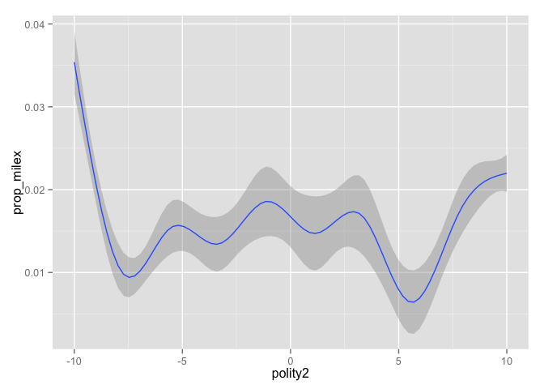

An Annotated Script for Merging COW and Polity Data
===================================================

by [Brenton Kenkel](http://bkenkel.com), Vanderbilt University

I'm working on a project that, like most empirical papers in international relations, requires data from both the [Correlates of War](http://correlatesofwar.org) project and the [Polity IV](http://www.systemicpeace.org/polity/polity4x.htm) project. Because [EUGene](http://www.eugenesoftware.org) hasn't been updated since 2011 and [NewGene](http://www.newgenesoftware.org) isn't available for Mac yet, I had to merge them manually. This proved to be less straightforward than I thought, so I'm writing up a script to replicate the steps I took.

If you don't care about the annotations and just want the script, see [`merge-cow-polity.r`](merge-cow-polity.r). The [R Markdown](http://rmarkdown.rstudio.com) source for this file is [`merge-cow-polity.Rmd`](merge-cow-polity.Rmd?raw=true).

If you see something wrong or want to extend this, feel free to [file an issue](https://github.com/brentonk/merge-cow-polity/issues) or a [pull request](https://github.com/brentonk/merge-cow-polity/pulls) on the associated GitHub repo. Or, if you're old-fashioned about these things, send me an email.

We'll be building a state-year dataset with material capability variables from COW and regime type variables from Polity. Most of what we do here would be applicable to a dyad-year dataset too, though the merging at the end would be less straightforward. These datasets come to us pretty clean—if the country codes were consistent across them, this whole procedure would be far too easy to warrant an annotated script. Unfortunately, they're not.

Get the Capabilities Data
-------------------------

We'll start by downloading the National Material Capabilities (v4.0) dataset from the Correlates of War project. You should probably review COW's [terms and conditions](http://cow.dss.ucdavis.edu/data-sets) before running the following code.

The material capabilities data can be downloaded in CSV format from [the COW website](http://cow.dss.ucdavis.edu/data-sets/national-material-capabilities). Codes of `-9` represent missing values, as specified in the call to `read.csv()`.

``` r
raw_NMC <- read.csv(url("http://cow.dss.ucdavis.edu/data-sets/national-material-capabilities/nmc-v4-data/at_download/file"),
                    na.strings = "-9",
                    stringsAsFactors = FALSE)
```

When we take a glance at the dataset, we see—thankfully—that it's already pretty clean.

``` r
dim(raw_NMC)
```

    ## [1] 14199    11

``` r
head(raw_NMC)
```

    ##   stateabb ccode year irst milex milper pec tpop upop     cinc version
    ## 1      USA     2 1816   80  3823     17 254 8659  101 0.039697       4
    ## 2      USA     2 1817   80  2466     15 277 8899  106 0.035817       4
    ## 3      USA     2 1818   90  1910     14 302 9139  112 0.036126       4
    ## 4      USA     2 1819   90  2301     13 293 9379  118 0.037133       4
    ## 5      USA     2 1820  110  1556     15 303 9618  124 0.037087       4
    ## 6      USA     2 1821  100  1612     11 321 9939  130 0.034173       4

The only thing apparent issue is that there's an extraneous `version` variable. To take that out, and for all our other data-cleaning purposes, we'll use the indispensable [**dplyr**](http://cran.rstudio.com/web/packages/dplyr/vignettes/introduction.html) package by [Hadley Wickham](https://github.com/hadley). We'll also make extensive use of the `%>%` "pipe" operator from the [**magrittr**](http://cran.r-project.org/web/packages/magrittr/vignettes/magrittr.html) package, where `x %>% f(y)` is equivalent to `f(x, y)`. To get rid of the version variable, we'll invoke **dplyr**'s `select()`.

``` r
library("dplyr")
data_NMC <- raw_NMC %>%
  select(-version)
```

We'll use the capabilities dataset (sans `version` variable) as the basis of our eventual merged state-year dataset.

Get the Polity Data
-------------------

The Polity dataset, which can be downloaded from the [Center for Systemic Peace](http://www.systemicpeace.org/inscrdata.html), poses a couple more initial problems. For one thing, it's only available in proprietary formats: SPSS or Excel.[1] We'll go with SPSS as that's the lesser of two evils in terms of importing into R.

``` r
library("foreign")
raw_polity <- read.spss("http://www.systemicpeace.org/inscr/p4v2014.sav",
                         to.data.frame = TRUE)
```

If we take a look at the raw data, we see it's not quite as tidy as the COW data, though not too unmanageable.

``` r
dim(raw_polity)
```

    ## [1] 16894    36

``` r
head(raw_polity)
```

    ##     cyear ccode scode                          country year flag fragment
    ## 1 7001800   700   AFG Afghanistan                      1800    0       NA
    ## 2 7001801   700   AFG Afghanistan                      1801    0       NA
    ## 3 7001802   700   AFG Afghanistan                      1802    0       NA
    ## 4 7001803   700   AFG Afghanistan                      1803    0       NA
    ## 5 7001804   700   AFG Afghanistan                      1804    0       NA
    ## 6 7001805   700   AFG Afghanistan                      1805    0       NA
    ##   democ autoc polity polity2 durable xrreg xrcomp xropen xconst parreg
    ## 1     1     7     -6      -6      NA     3      1      1      1      3
    ## 2     1     7     -6      -6      NA     3      1      1      1      3
    ## 3     1     7     -6      -6      NA     3      1      1      1      3
    ## 4     1     7     -6      -6      NA     3      1      1      1      3
    ## 5     1     7     -6      -6      NA     3      1      1      1      3
    ## 6     1     7     -6      -6      NA     3      1      1      1      3
    ##   parcomp exrec exconst polcomp prior emonth eday eyear eprec interim
    ## 1       3     1       1       6    NA     NA   NA    NA    NA      NA
    ## 2       3     1       1       6    NA     NA   NA    NA    NA      NA
    ## 3       3     1       1       6    NA     NA   NA    NA    NA      NA
    ## 4       3     1       1       6    NA     NA   NA    NA    NA      NA
    ## 5       3     1       1       6    NA     NA   NA    NA    NA      NA
    ## 6       3     1       1       6    NA     NA   NA    NA    NA      NA
    ##   bmonth bday byear bprec post change d4 sf regtrans
    ## 1      1    1  1800     1   -6     88  1 NA       NA
    ## 2     NA   NA    NA    NA   NA     NA NA NA       NA
    ## 3     NA   NA    NA    NA   NA     NA NA NA       NA
    ## 4     NA   NA    NA    NA   NA     NA NA NA       NA
    ## 5     NA   NA    NA    NA   NA     NA NA NA       NA
    ## 6     NA   NA    NA    NA   NA     NA NA NA       NA

First, though it's not visible here, many values are coded –66, –77, or –88, representing unusual cases not covered by the standard numbering system. Following usual practice in political science, we'll need to convert these to missing values. We'll use `mutate_each()` to apply the same function for every column in the dataset (except the identifying variables for which there'd be no missingness).

Second, country names have too much whitespace (yikes) and are treated as factors instead of strings (double yikes). To fix the former problem, we'll rely on the very handy [**stringr**](http://cran.r-project.org/web/packages/stringr/vignettes/stringr.html) package, also by Hadley Wickham. For the latter, all we need is `as.character()`. To transform a single variable, we'll use the `mutate()` function.

Third, there's a bunch of variables here we don't care about. In particular, I'm going to operate under the assumption that we just want the regime types and their component variables, not auxiliary information like transition dates or other functions of the underlying information. We probably also don't want things like `cyear`, which is just `ccode` and `year` mushed together. Again, we'll use `select()` to remove variables.

``` r
library("stringr")
data_polity <- raw_polity %>%
  mutate_each(funs(ifelse(. %in% c(-66, -77, -88), NA, .)),
              -(ccode:year)) %>%
  mutate(country = str_trim(as.character(country))) %>%
  select(-cyear,
         -scode,
         -flag,
         -fragment,
         -durable,
         -(prior:regtrans))
```

After all that, we end up with something nicer-looking.

``` r
head(data_polity)
```

    ##   ccode     country year democ autoc polity polity2 xrreg xrcomp xropen
    ## 1   700 Afghanistan 1800     1     7     -6      -6     3      1      1
    ## 2   700 Afghanistan 1801     1     7     -6      -6     3      1      1
    ## 3   700 Afghanistan 1802     1     7     -6      -6     3      1      1
    ## 4   700 Afghanistan 1803     1     7     -6      -6     3      1      1
    ## 5   700 Afghanistan 1804     1     7     -6      -6     3      1      1
    ## 6   700 Afghanistan 1805     1     7     -6      -6     3      1      1
    ##   xconst parreg parcomp exrec exconst polcomp
    ## 1      1      3       3     1       1       6
    ## 2      1      3       3     1       1       6
    ## 3      1      3       3     1       1       6
    ## 4      1      3       3     1       1       6
    ## 5      1      3       3     1       1       6
    ## 6      1      3       3     1       1       6

Fix Inconsistent Country Codes
------------------------------

This is the meat of the operation. Polity identifies countries according to their COW codes for the most part but contains some deviations. We'll try to smooth those over as sensibly as possible.

The easiest way to find discrepancies is to identify countries that are in the Polity data but not in COW.

``` r
in_NMC <- sort(unique(data_NMC$ccode))
in_polity <- sort(unique(data_polity$ccode))
polity_minus_NMC <- setdiff(in_polity, in_NMC)

for (x in polity_minus_NMC) {
    years_x <- with(data_polity, range(year[ccode == x])) %>%
      paste(collapse = "-")
    names_x <- with(data_polity, unique(country[ccode == x])) %>%
      paste(collapse = "/")
    cat(x, ": ", names_x, " (", years_x, ")\n", sep = "")
}
```

    ## 89: United Province CA (1824-1838)
    ## 99: Gran Colombia (1821-1832)
    ## 324: Sardinia (1815-1861)
    ## 342: Serbia (1830-2014)
    ## 347: Yugoslavia/Serbia and Montenegro (1991-2006)
    ## 348: Montenegro (2006-2014)
    ## 364: USSR (1922-1991)
    ## 525: South Sudan (2011-2014)
    ## 529: Ethiopia (1993-2014)
    ## 564: Orange Free State (1854-1902)
    ## 626: Sudan-North (2011-2014)
    ## 769: Pakistan (1947-1971)
    ## 818: Vietnam (1976-2014)

We'll go through each of these in turn. First, let's define a helpful function to identify cases in the Polity data where two country codes overlap (i.e., there are observations for both in the same year).

``` r
find_overlap <- function(c1, c2) {
    overlap_years <- with(data_polity,
                          intersect(year[ccode == c1],
                                    year[ccode == c2]))
    data_polity %>% filter(year %in% overlap_years,
                           ccode %in% c(c1, c2))
}
```

All references to dates of independence below are taken from Wikipedia.

### United Provinces of Central America (89)

This is not coded as a member of [the state system](http://cow.dss.ucdavis.edu/data-sets/state-system-membership) according to COW, and each of its component states (Guatemala, El Salvador, Honduras, Nicaragua, Costa Rica) is coded as entering the international system well after 1838. Therefore, ignored.

### Gran Colombia (99)

Gran Colombia is the predecessor to Colombia,[2] so this should be coded the same as Colombia (100). It really only matters for 1831, which is when Colombia is coded as entering the international system.

``` r
with(data_NMC, min(year[ccode == 100]))
```

    ## [1] 1831

So we'll recode all the 99s as 100s. The tricky part is that there's some overlap.

``` r
find_overlap(99, 100)
```

    ##   ccode       country year democ autoc polity polity2 xrreg xrcomp xropen
    ## 1   100      Colombia 1832     4     2      2       2     3      3      4
    ## 2    99 Gran Colombia 1832    NA    NA     NA      -5    NA     NA     NA
    ##   xconst parreg parcomp exrec exconst polcomp
    ## 1      3      3       3     8       3       6
    ## 2     NA     NA      NA    NA      NA      NA

Since the Gran Colombia variables are almost all missing, we'll use the 1832 codings for Colombia. Specifically, we'll first drop Gran Colombia 1832 from the dataset, then recode all the other Gran Colombia observations as Colombia.

``` r
data_polity <- data_polity %>%
  filter(ccode != 99 | year != 1832) %>%
  mutate(ccode = ifelse(ccode == 99, 100, ccode))
```

### Sardinia (324)

Following [the EUGene documentation](http://www.eugenesoftware.org/EUGeneDocumentation%20v3.2.pdf) (p. 63), Sardinia should be treated the same as Italy (325). Once again, we have some overlap.

``` r
find_overlap(324, 325)
```

    ##   ccode  country year democ autoc polity polity2 xrreg xrcomp xropen
    ## 1   325    Italy 1861     1     5     -4      -4     3      1      2
    ## 2   324 Sardinia 1861     0     7     -7      -7     3      1      2
    ##   xconst parreg parcomp exrec exconst polcomp
    ## 1      3      3       3     2       3       6
    ## 2      3      4       2     2       3       2

Since the Italian kingdom was proclaimed in March 1861, we'll give the balance of the year to Italy as opposed to Sardinia, which is also what EUGene does.

``` r
data_polity <- data_polity %>%
  filter(ccode != 324 | year != 1861) %>%
  mutate(ccode = ifelse(ccode == 324, 325, ccode))
```

### Serbia (342) and Yugoslavia/Serbia and Montenegro (347)

According to COW, Yugoslavia (345) is a state that has existed from 1878 to the present, with a three-year break during World War II. I don't make the rules, I just play by them. At any rate, to merge Polity into the COW data, we should recode all of these as 345s. There is, once again, some overlap.

``` r
find_overlap(342, 345)
```

    ##  [1] ccode   country year    democ   autoc   polity  polity2 xrreg  
    ##  [9] xrcomp  xropen  xconst  parreg  parcomp exrec   exconst polcomp
    ## <0 rows> (or 0-length row.names)

``` r
find_overlap(342, 347)
```

    ##   ccode               country year democ autoc polity polity2 xrreg xrcomp
    ## 1   342                Serbia 2006     9     1      8       8     3      3
    ## 2   347 Serbia and Montenegro 2006     6     0      6       6     2      2
    ##   xropen xconst parreg parcomp exrec exconst polcomp
    ## 1      4      7      3       4     8       7       8
    ## 2      4      6      2       3     7       6       7

``` r
find_overlap(345, 347)
```

    ##   ccode    country year democ autoc polity polity2 xrreg xrcomp xropen
    ## 1   347 Yugoslavia 1991     0     5     -5      -5     2      1      4
    ## 2   345 Yugoslavia 1991     0     5     -5      -5     2      1      4
    ##   xconst parreg parcomp exrec exconst polcomp
    ## 1      3      3       2     3       3       3
    ## 2      3      3       2     3       3       3

It doesn't matter which we choose for 1991, since the variables are identical for each coding. 2006 is trickier. Since Montenegro became independent in early June 2006, meaning Serbia was "Serbia" (342) for more of 2006 than it was "Serbia and Montenegro" (347), we'll use the former coding. To sum up, we'll drop the overlapping 347s in 1991 and 2006, then recode all 342s and 347s as 345.

``` r
data_polity <- data_polity %>%
  filter(ccode != 347 | !(year %in% c(1991, 2006))) %>%
  mutate(ccode = ifelse(ccode %in% c(342, 347), 345, ccode))
```

### Montenegro (348)

Now this one is just annoying. COW codes Montenegro as 341 and Kosovo as 347. Polity codes Montenegro as 348 and Kosovo as 341. We'll switch so as to match the COW codings. This step must be done after the Yugoslavia fixes, or else some of the Kosovo and Yugoslavia/Serbia and Montenegro observations will get mixed up.

``` r
data_polity <- data_polity %>%
  mutate(ccode = ifelse(ccode == 341, 347, ccode),
         ccode = ifelse(ccode == 348, 341, ccode))
```

### USSR (364)

COW treats Russia (365) as a continuous country, while Polity treats Russia and the USSR separately. And, of course, we have overlap.

``` r
find_overlap(364, 365)
```

    ##   ccode country year democ autoc polity polity2 xrreg xrcomp xropen xconst
    ## 1   365  Russia 1922     1     2     -1      -1     1      0      0      3
    ## 2   364    USSR 1922     0     7     -7      -7     2      1      4      3
    ##   parreg parcomp exrec exconst polcomp
    ## 1      3       3     4       3       6
    ## 2      4       1     3       3       1

Luckily, since the Soviet Union was proclaimed on December 30, 1922, we can safely use the Russia coding for 1922.

``` r
data_polity <- data_polity %>%
  filter(ccode != 364 | year != 1922) %>%
  mutate(ccode = ifelse(ccode == 364, 365, ccode))
```

### South Sudan (525) and Sudan–North (626)

These begin in the Polity series in 2011, but the COW data end in 2007, so in theory we don't have to worry about them. However, this will eventually be a problem, since COW codes Sudan (625) as existing continuously and assigns 626 to South Sudan. So we need to merge Polity's 626s into its 625s, then code its 525s as 626s.

``` r
find_overlap(625, 626)
```

    ##   ccode     country year democ autoc polity polity2 xrreg xrcomp xropen
    ## 1   626 Sudan-North 2011     0     4     -4      -4     1      0      0
    ## 2   625       Sudan 2011     1     3     -2      -2     1      0      0
    ##   xconst parreg parcomp exrec exconst polcomp
    ## 1      2      3       2     4       2       3
    ## 2      2      3       3     4       2       6

South Sudanese independence was proclaimed on July 9, 2011, so we'll treat the balance of 2011 as "Sudan" (625) rather than "Sudan–North" (626).

``` r
data_polity <- data_polity %>%
  filter(ccode != 626 | year != 2011) %>%
  mutate(ccode = ifelse(ccode == 626, 625, ccode),
         ccode = ifelse(ccode == 525, 626, ccode))
```

### Orange Free State (564)

This is not coded as a member of the international system, and even South Africa is not coded as a system member until 1920, long after the Orange Free State's demise. Therefore, ignored.

### Pakistan (769)

Polity has separate codes for Pakistan for 1947–1971 (769) and for 1972 onward (770). COW only uses 770. Luckily, there is no overlap.

``` r
find_overlap(769, 770)
```

    ##  [1] ccode   country year    democ   autoc   polity  polity2 xrreg  
    ##  [9] xrcomp  xropen  xconst  parreg  parcomp exrec   exconst polcomp
    ## <0 rows> (or 0-length row.names)

So we can just recode all the 769s as 770s.

``` r
data_polity <- data_polity %>%
  mutate(ccode = ifelse(ccode == 769, 770, ccode))
```

### Vietnam (818)

COW codes (North) Vietnam (816) as existing continuously from 1954 to the present, whereas Polity codes the pre- and post-unification states separately. The two codings overlap in the Polity data in 1976, but we can use either since there is no difference in the variables.

``` r
find_overlap(816, 818)
```

    ##   ccode       country year democ autoc polity polity2 xrreg xrcomp xropen
    ## 1   816 Vietnam North 1976     0     7     -7      -7     2      1      4
    ## 2   818       Vietnam 1976     0     7     -7      -7     2      1      4
    ##   xconst parreg parcomp exrec exconst polcomp
    ## 1      3      4       1     3       3       1
    ## 2      3      4       1     3       3       1

``` r
data_polity <- data_polity %>%
  filter(ccode != 818 | year != 1976) %>%
  mutate(ccode = ifelse(ccode == 818, 816, ccode))
```

### Austria-Hungary (300)

This case is the opposite of those just listed—it's a state that's in the COW data but not in Polity, which always codes Austria (305) and Hungary (310) separately. We will follow EUGene in using the Austria codings for Austria-Hungary, though in the vast majority of years it would make no difference whether we used Austria or Hungary.

From a technical perspective, we have to do this a bit differently. We'll create entries for Austria-Hungary in the Polity data by copying the relevant years from the Austria series. Since we're ultimately merging into the COW data, we don't have to worry about dropping years from the Austria series in the Polity data.

``` r
years_ah <- with(data_NMC,
                 year[ccode == 300])
data_polity <- rbind(data_polity,
                     data_polity %>%
                       filter(year %in% years_ah,
                              ccode == 305) %>%
                       mutate(ccode = 300))
```

There are a number of other countries that are in the COW data but not in the Polity data. However, all of these seem to be countries that are simply too small to be tracked by the Polity project (e.g., the Bahamas, Liechtenstein, the Federated States of Micronesia) or defunct German principalities (e.g., the Kingdom of Hanover, the Hesse Grand Ducal).

Merge the Datasets
------------------

With our country codes now as consistent as possible across datasets, we can safely (I hope) merge them. We'll do this via **dplyr**'s `left_join()` function, after taking out the no-longer-useful `country` name variable from the Polity set.

``` r
data_state_year <- left_join(data_NMC,
                             data_polity %>% select(-country),
                             by = c("ccode", "year"))
```

Ta-da! Let's see what we hath wrought.

``` r
dim(data_state_year)  # Should be same as `data_NMC`
```

    ## [1] 14199    23

``` r
head(data_state_year)
```

    ##   stateabb ccode year irst milex milper pec tpop upop     cinc democ autoc
    ## 1      USA     2 1816   80  3823     17 254 8659  101 0.039697     9     0
    ## 2      USA     2 1817   80  2466     15 277 8899  106 0.035817     9     0
    ## 3      USA     2 1818   90  1910     14 302 9139  112 0.036126     9     0
    ## 4      USA     2 1819   90  2301     13 293 9379  118 0.037133     9     0
    ## 5      USA     2 1820  110  1556     15 303 9618  124 0.037087     9     0
    ## 6      USA     2 1821  100  1612     11 321 9939  130 0.034173     9     0
    ##   polity polity2 xrreg xrcomp xropen xconst parreg parcomp exrec exconst
    ## 1      9       9     3      3      4      7      2       4     8       7
    ## 2      9       9     3      3      4      7      2       4     8       7
    ## 3      9       9     3      3      4      7      2       4     8       7
    ## 4      9       9     3      3      4      7      2       4     8       7
    ## 5      9       9     3      3      4      7      2       4     8       7
    ## 6      9       9     3      3      4      7      2       4     8       7
    ##   polcomp
    ## 1       9
    ## 2       9
    ## 3       9
    ## 4       9
    ## 5       9
    ## 6       9

And now we can do fun things like analyze the relationship between regime type and military capabilities. We can use **dplyr**'s `group_by()` and `summarize()` to calculate world military expenditures for each year.

``` r
data_milex <- data_state_year %>%
  group_by(year) %>%
  summarise(world_milex = sum(milex, na.rm = TRUE))
```

Then we can merge this back into our state-year data in order to calculate each state's annual share of military expenditures.

``` r
data_state_year <- left_join(data_state_year,
                             data_milex,
                             by = "year") %>%
  mutate(prop_milex = milex / world_milex)
```

And now we can examine a state's proportion of total military spending as a function of its regime type.

``` r
library("ggplot2")
print(ggplot(data_state_year, aes(x = polity2, y = prop_milex)) +
        geom_smooth())
```

    ## Warning in loop_apply(n, do.ply): Removed 2817 rows containing missing
    ## values (stat_smooth).



Conclusion
----------

The only difficulty in cleaning and merging COW and Polity data is the presence of inconsistent country codes. The process of fixing them is made less unpleasant thanks to **dplyr**.

License
-------

All code in this repository is distributed under the [MIT License](LICENSE).

[1] The dataset is available elsewhere in open formats, such as [in CSV format](http://zmjones.com/static/data/polity.csv) from [Zach Jones](http://zmjones.com), but for a variety of reasons I prefer to obtain it straight from the source.

[2] In theory it could also be treated as the predecessor to Venezuela and Ecuador as well, but those enter the international system well after 1832.
